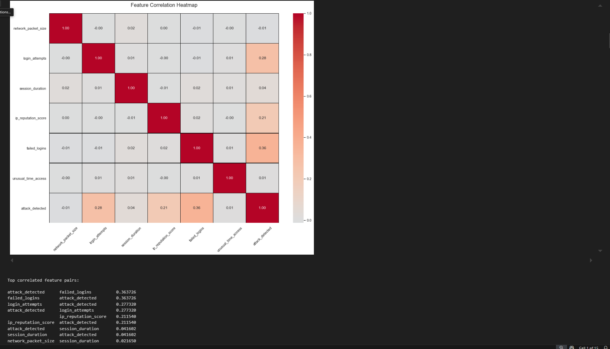

# DSA2040A_DataMining_Group4

# Cybersecurity Intrusion Data Mining Project

## Contributors

Hetal - ETL

Chad – Analyst

Marilyn – Data Mining

Rita – Initial extract, dashboard & documenter


## Overview

This project analyzes cybersecurity intrusion data using both supervised and unsupervised machine learning techniques, as well as association rule mining. The workflow covers data extraction, transformation, exploratory data analysis, modeling, clustering, and association rule mining to uncover patterns and insights related to network attacks.

## Project Structure

```

├── data/ 
│   ├── raw/ 
│   │   └── cybersecurity_intrusion_data.csv
│   ├── transformed/ 
│   │   └── transformed_cybersecurity_intrusion_data.csv
│   └── processed/ 
│       └── eda_processed_cybersecurity_data.csv
├── notebooks/ 
│   ├── 1_extract_transform.ipynb         # Data extraction, cleaning, and transformation
│   ├── 2_exploratory_data_analysis.ipynb # Exploratory data analysis (EDA)
│   ├── 3_data_mining.ipynb               # Modeling, clustering, association rule mining
│   └── 4_insights_dashboard.ipynb        # Dashboard planning and design
├── report/ 
│   ├── executive_summary.pdf 
│   └── presentation.pptx 
└── README.md

```

## Data Description

The dataset contains network session records with the following columns:

- `usession_id`: Unique session identifier
- `network_packet_size`: Size of network packets (bytes)
- `protocol_type`: Protocol used (TCP, UDP, ICMP)
- `login_attempts`: Number of login attempts in the session
- `session_duration`: Duration of the session (seconds)
- `encryption_used`: Encryption protocol used (e.g., AES, DES, None)
- `ip_reputation_score`: Reputation score of the IP address
- `failed_logins`: Number of failed login attempts
- `browser_type`: Browser used
- `unusual_time_access`: Whether access occurred at an unusual time (0/1)
- `attack_detected`: Whether an attack was detected (0/1)

## Workflow

### 1. Data Extraction & Transformation

- Performed in [1_extract_transform.ipynb](1_extract_transform.ipynb).
- Loads raw data, checks for missing values and duplicates, and applies necessary cleaning:


   - Fills missing values in `encryption_used` with `"None"`.


   - Ensures consistent casing for categorical columns.


   - Removes duplicates (if any) and handles outliers.


   - Saves the cleaned data to `data/transformed/transformed_cybersecurity_intrusion_data.csv`.

### 2. Exploratory Data Analysis (EDA)

- Conducted in [2_exploratory_data_analysis.ipynb](2_exploratory_data_analysis.ipynb).
- Visualizes distributions, checks for outliers, and summarizes key statistics.



### 3. Data Mining

All data mining steps are in [3_data_mining.ipynb](3_data_mining.ipynb):

#### a. Data Preparation

- Loads the transformed dataset.
- Drops `usession_id` and handles missing values.
- Encodes categorical variables using `LabelEncoder`.
- Scales numerical features with `StandardScaler`.
- Splits data into features (`X`) and target (`y`).

#### b. Supervised Learning

- **Models Used:** Logistic Regression, Decision Tree, Random Forest.
- **Evaluation:** Accuracy, precision, recall, F1-score, and confusion matrices.
- **Best Model:** Random Forest (highest accuracy and F1-score for attack detection).

#### c. Unsupervised Learning

- **KMeans Clustering:**
  - Uses the elbow method to determine optimal clusters (k=4).
  - Visualizes clusters using PCA.
  - Analyzes cluster characteristics and their relation to attacks.
- **DBSCAN:**
  - Detects clusters and noise (outliers).
  - Compares DBSCAN clusters with attack labels.

#### d. Association Rule Mining

- Prepares data by binarizing and one-hot encoding relevant features.
- Applies the Apriori algorithm to find frequent itemsets.
- Generates association rules (using `mlxtend`).
- **Key Insight:** Sessions with attacks have a high likelihood (87% confidence) of at least one failed login.

### 4. Dashboard
The Power BI dashboard analyzes cybersecurity session data to support intrusion detection and risk assessment. It is organized into two pages:

#### Page 1: Risk & Threat Analytics
Focuses on identifying suspicious sessions and highlighting threat patterns.


##### Key Visuals:
 - Attack vs. Non-Attack Sessions (Donut chart) - Shows the overall distribution of attack-labeled vs safe sessions.
 - Top 20 Risky Sessions (Table) - Lists sessions with the most critical risk factors (e.g., failed logins, low IP reputation).
 - Failed Logins by Browser (Stacked bar chart) - Identifies browsers frequently used in failed login attempts.
 - Top 10 Longest Sessions (Clustered column chart) - Highlights potentially stealthy or persistent session activity.
 - KPI Cards: Summarize average attack rate, failed login attempts and IP reputation scores.


#### Page 2: Cybersecurity Session Overview
Provides broader trends across protocols, encryption and session behaviors.
 


##### Key Visuals:
 - 	Sessions by Encryption Type (Stacked column chart) - Displays counts of sessions using AES, DES or no encryption.
 - Unusual Time Access (Pie chart) - Shows the proportion of sessions occurring at non-standard hours.
 - Protocol Type Distribution (Donut chart) - Compares session counts by protocol (TCP, UDP, ICMP).
 - 	Browser vs. Attack (Stacked bar chart) - Relates browser usage to attack frequency.
 - Top 10 Sessions by Network Packet Size (Table) - Displays the largest data sessions with browser and protocol details.
 - KPI Cards - Show total sessions, number of attack sessions and average session duration.
 - Filters & Interactivity: Includes a slicer to filter by protocol type for deeper drill-down.


## How to Run

1. **Install dependencies:**
   - Python 3.x
   - pandas, numpy, scikit-learn, matplotlib, seaborn, mlxtend

   ```sh
   pip install pandas numpy scikit-learn matplotlib seaborn mlxtend
   ```

2. **Run notebooks in order:**
   - Start with [1_extract_transform.ipynb](1_extract_transform.ipynb) to clean and transform the data.
   - Proceed to [2_exploratory_data_analysis.ipynb](2_exploratory_data_analysis.ipynb) for EDA.
   - Finish with [3_data_mining.ipynb](3_data_mining.ipynb) for modeling, clustering, and association rule mining.

## Results & Insights

- **Random Forest** is the best model for attack detection (accuracy: 0.89, perfect precision for attacks).
- **Failed logins** are highly predictive of attacks (87% confidence in association rules).
- **Cluster analysis** reveals groups with higher login attempts are more likely to be associated with attacks.

For more details, see the individual notebooks.


